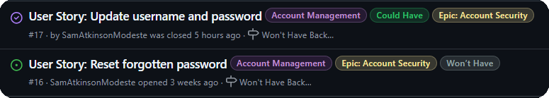
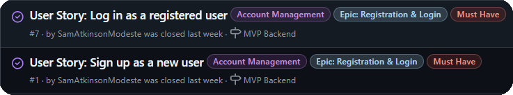
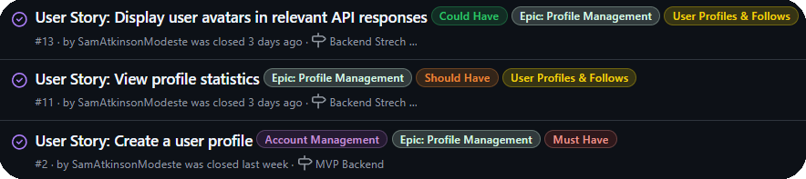
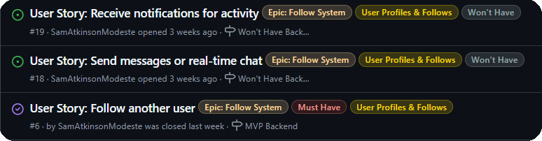
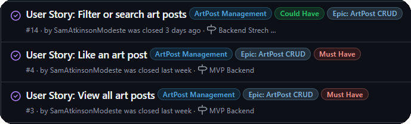
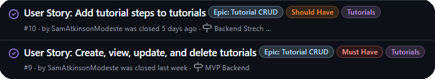
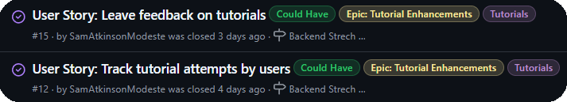

## 🌀 Agile Methodologies

### 📑 Table of Contents

- [✅ Overview](#-overview)
- [🏷️ MoSCoW Prioritisation](#-moscow-prioritisation)
- [🧩 Themes & Epics](#-themes--epics)
  - [🎯 Account Management](#-theme-account-management)
  - [👤 User Profiles & Follows](#-theme-user-profiles--follows)
  - [🎨 ArtPost Management](#-theme-artpost-management)
  - [📚 Tutorials](#-theme-tutorials)
- [📈 Iteration & Progress](#-iteration--progress)
- [🚀 Outcome](#-outcome)

This project followed an Agile development approach, using **User Stories**, **MoSCoW prioritisation**, and **GitHub Project boards** to stay focused, deliver iteratively, and track progress clearly.

---

### ✅ Overview

From day one, the goal was to build this API in a flexible and organised way. Agile methods helped break down features into manageable units, prioritise what mattered most, and ensure steady progress — even when things got challenging.

Project tracking and planning were split between:

- **Trello**: Used during the early planning stage to sketch out ideas, themes, epics, and MoSCoW labels before committing to GitHub issues.
- **GitHub Projects**: Used to manage issues, assign epics, set priorities, and track development milestones.

This workflow made it easier to:

- Work iteratively
- Stay focused on the core features
- Adjust and refocus priorities without losing structure

[Back to top ⬆️](#-agile-methodologies)

---

### 🏷️ MoSCoW Prioritisation

All GitHub issues were tagged using the MoSCoW method:

-  – Core functionality: user registration, profiles, CRUD endpoints, tutorial system
-  – Feedback system, pagination, staff-restricted actions
-  – Likes on attempts, comments, following users
-  – Password updates and in-app messaging were out of scope for this project

[Back to top ⬆️](#-agile-methodologies)

---

### 🧩 Themes & Epics

To keep things organised, I grouped user stories into broader **themes** — these were categories that tied together related functionality. From those themes, I created more focused **epics** that each represented a major part of the site’s functionality.

---

### 🎯 Theme: Account Management

_Covers all things related to user accounts and secure access._

- 🔐 **Epic: Account Security** — Permissions, ownership checks, safe data handling
  

- 🔑 **Epic: Registration & Login** — User sign-up and login/logout via dj-rest-auth
  
- 🪪 **Epic: Token Handling** — JWT token-based authentication and token expiration
  

[Back to top ⬆️](#-agile-methodologies)

---

### 👤 Theme: User Profiles & Follows

_Focuses on personalisation and user-to-user interaction._

- 🧾 **Epic: Profile Management** — Create, update, and view user profiles
  
- 🤝 **Epic: Follow System** — Follow/unfollow users, display follower metrics
  

[Back to top ⬆️](#-agile-methodologies)

---

### 🎨 Theme: ArtPost Management

_Handles digital art uploads, display, and engagement features._

- 🖼️ **Epic: ArtPost CRUD** — Create, read, update, and delete artworks
  
- 💬 **Epic: Comment CRUD** — Comments on artworks, with full permissions and owner logic
  

[Back to top ⬆️](#-agile-methodologies)

---

### 📚 Theme: Tutorials

_Enables a structured learning workflow for both mentors and learners._

- 🧠 **Epic: Tutorial CRUD** — Create tutorials, update steps, mentor management
  
- ✨ **Epic: Tutorial Enhancements** — Submitting attempts, feedback, likes, favourites
  

[Back to top ⬆️](#-agile-methodologies)

---

Each of the epics above was tracked in GitHub Projects and supported by user stories with MoSCoW prioritisation. Screenshots of all relevant issues are included below.

---

### 📈 Iteration & Progress

Rather than fixed-length sprints, I used **milestones** in GitHub to reflect key stages of progress:

- Planning & setup
- Core models and views
- Tutorial system
- Feedback and enhancements
- Final bug fixes and deployment

Progress wasn’t always linear — and that’s the beauty of Agile. I adjusted priorities as new ideas emerged, and as bugs were found.

[Back to top ⬆️](#-agile-methodologies)

---

### 🚀 Outcome

Using Agile methods helped me stay organised and on track while building a fairly large Django REST API from scratch. Even solo, having clear issues, labels, and priorities gave me a structure that made development faster and less overwhelming.

It also meant I had a strong paper trail of what was built, why it was prioritised, and how it all came together.

🧪 Testing details and bug logs are available in [TEST.md](./TEST.md).

---

🔙 [Back To README](./README.md) **|** [Back to top ⬆️](#-agile-methodologies)
