## ArtifexLab API 🎨

---

**The brains behind the art.** 🧠
_A Django REST API powering a creative showcase platform._

🌐 [Click here to view the live deployed API](https://artifexlab-api-d4e6d81a8b08.herokuapp.com/)

---

---

A RESTful backend API built with Django REST Framework to power **ArtifexLab** — a creative hub where digital artists, designers, and creators can showcase their work, grow their skills, and connect with a supportive community.
At its heart, ArtifexLab is about collaboration and encouragement. Users can cheer each other on through likes and thoughtful comments, while mentors provide guidance and feedback to those engaging with tutorials. Whether you're here to share your passion, learn something new, or support fellow artists — **ArtifexLab** is built to help you thrive.
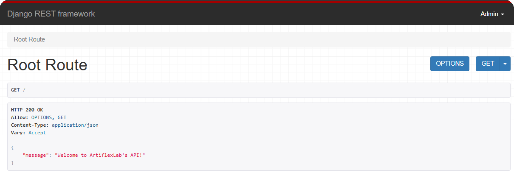

---

## 📚 Table of Contents

<details>
  <summary><strong><span style="font-size: 1.1em;">👈 Click the arrow to view table of contents 📖</span></strong></summary>

- [📌 Project Overview](#-project-overview)
- [🎯 API Aims](#-api-aims)
- [🧑‍💻 User Stories](#-user-stories)
  - [Registered User](#as-a-registered-user-i-can)
  - [Unregistered User](#as-an-unregistered-user-i-can)
  - [Mentor](#as-a-mentor-i-can)
  - [Site Admin](#as-a-site-admin-i-can)
- [📁 Frontend Repository](#-frontend-repository)
- [🔧 Core Technologies Used](#-core-technologies-used)
- [🧬 Database Schema](#-database-schema)
  - [🖼️ Schema Diagram](#️-schema-diagram)
  - [🔑 Key Models Overview](#-key-models-overview)
- [🌀 Agile Development](#-agile-development)
- [✨ Features](#-features)
  - [🧑‍🎨 User Profile](#-user-profile)
  - [🎨 Artwork List View](#-artwork-list-view)
  - [💬 Artwork Comments List View](#-artwork-comments-list-view)
  - [📘 Tutorials List View](#-tutorials-list-view)
  - [🧾 Tutorial Step Detail View](#-tutorial-step-detail-view)
  - [🧪 Tutorial Attempt List View](#-tutorial-attempt-list-view)
  - [💬 Tutorial Feedback View](#-tutorial-feedback-view)
  - [👥 Followers List View](#-followers-list-view)
- [🔍 API Filtering, Searching, and Ordering](#-api-filtering-searching-and-ordering)
  - [🎨 Artwork List Filters](#-artwork-list-filters)
  - [🔎 Search and Ordering](#-search-and-ordering)
- [🚀 Deployment](#-deployment)
- [🔐 Authentication & Permissions](#-authentication--permissions)
  - [🪪 Authentication](#-authentication)
  - [🛡️ Permissions](#️-permissions)
- [📚 Helpful Resources](#-helpful-resources)
- [🔮 Future Enhancements](#-future-enhancements)
  - [✨ Planned Ideas for Expansion](#-planned-ideas-for-expansion)
  - [🚫 Won’t Haves (for MVP)](#-wont-haves-for-mvp)
- [🧪 Testing](#-testing)
- [📝 Credits](#-credits)
- [🏅 Honourable Mentions](#-honourable-mentions)

</details>

<br>
<div align="center">
  <a href="https://github.com/SamAtkinsonModeste/artifexlab-api/commits/main">
    
  </a>
  <a href="https://github.com/SamAtkinsonModeste/artifexlab-api">
    
  </a>
  <a href="https://github.com/SamAtkinsonModeste/artifexlab-api/issues">
    
  </a>
  
</div>

---

## 📌 Project Overview

The **ArtifexLab API** is the backend system behind a vibrant creative platform where users can share digital artwork, engage with community tutorials, and interact through likes, comments, and follows.

Built using **Django REST Framework**, the API handles secure authentication, user profile management, and full CRUD functionality for artworks and tutorials. It also supports custom feedback features and social interactions to encourage learning, growth, and mentorship within the creative community.

Designed to integrate seamlessly with the React-based frontend, this API provides a scalable and structured foundation that empowers creators to connect, inspire, and thrive.

---

## 🎯 API Aims

The **ArtifexLab API** was developed to serve as the backend for a creative community platform. Its primary goals are:

- To manage user authentication and secure access to protected content
- To provide full CRUD (Create, Read, Update, Delete) functionality for:
  - Artworks uploaded by users
  - Tutorials created by mentors
  - User profiles and bios
  - Comments on artworks and tutorials
  - Like and favourite actions
- To enable social interactions through follows, likes, and comments
- To allow mentors to provide feedback on tutorial attempts submitted by users
- To deliver filtered and personalized content (e.g., artwork from followed users, favourited tutorials)
- To support learning and growth through structured tutorial content
- To integrate cleanly with the React-based frontend via RESTful endpoints

[Back to top ⬆️](#-table-of-contents)

---

## 🧑‍💻 User Stories

These user stories reflect the core functionality supported by the **ArtifexLab API**.

### As a **Registered User**, I can:

- Create an account, log in, and log out securely
- View a feed of artworks from all users or just those I follow
- Upload new artwork with images and captions
- Update or delete my own artworks
- View tutorials created by mentors
- Comment on both artworks and tutorials
- Like or unlike artworks
- Favourite or unfavourite tutorials
- Follow or unfollow other users
- Create and edit my user profile, including uploading a profile image and writing a bio
- Submit a tutorial attempt and receive feedback from a mentor

### As an **Unregistered User**, I can:

- Sign up for an account to access features and interact with the community

### As a **Mentor**, I can:

- Create, edit, or delete tutorials
- Create, edit or delete steps for my tutorials
- View and provide feedback on tutorial attempts submitted by users

### As a **Site Admin**, I can:

- Manage all content through the Django admin panel
- Moderate inappropriate content or user activity as needed

These user stories focus specifically on the backend API. Frontend functionality is handled in a separate repository.

[Back to top ⬆️](#-table-of-contents)

---

###### 📁 Frontend Repository

The **Frontend Repository** that connects with this API can be found here:👇

<div align="right"><a href="https://github.com/SamAtkinsonModeste/artifexlab">🔗 ArtifexLab Frontend Repository</a></div>

[Back to top ⬆️](#-table-of-contents)

---

### 🔧 Core Technologies Used

- **Python 3.11** — Core programming language
- **Django** — High-level Python web framework
- **Django REST Framework** — Used to build the API
- **PostgreSQL** — Production database (via ElephantSQL)
- **Cloudinary** — Media hosting for user-uploaded images
- **dj-rest-auth** — Authentication and token handling
- **Heroku** — Platform for API deployment
- **CORS Headers** — Enables frontend-backend communication

[Back to top ⬆️](#-table-of-contents)

---

### 🧬 Database Schema

The **ArtifexLab API** is powered by a relational PostgreSQL database. The schema was designed using Luna Modeler, allowing for clear relationships between users, creative content, social interactions, and educational features.

It follows Django’s relational model structure, with one-to-many and many-to-one relationships across artworks, tutorials, tutorial attempts, and their associated likes, comments, and feedback. Each model is tightly scoped for clarity, scalability, and separation of concerns.

#### 🖼️ Schema Diagram

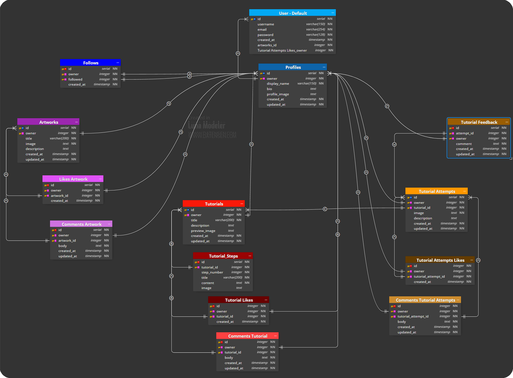

Schema diagram created with [Luna Modeler](https://www.datensen.com/luna-modeler-for-relational-databases.html) and exported from the final database structure.

##### 🔑 Key Models Overview

**User** – Default Django user model storing account credentials

**Profiles** – Extends the User model with display name, image, and bio; used for linking to all user-created content

**Artworks** – Represents digital artwork submitted by users, including image, title, and description

**Likes Artwork / Comments Artwork** – Tracks likes and comments on individual artworks

**Tutorials** – Authored by mentors, these contain educational content including images and step-by-step instructions

**Tutorial Steps** – A breakdown of individual steps for each tutorial

**Tutorial Likes / Comments** – Enables user interaction with tutorial content

**Tutorial Attempts** – Stores submissions from users attempting tutorials, including optional images and written descriptions

**Tutorial Feedback** – Feedback left by mentors in response to tutorial attempts

**Tutorial Attempt Likes / Comments** – Lets users appreciate or comment on each other’s submissions

**Follows** – Tracks user-following relationships to power personalized feeds

This schema supports full CRUD functionality, detailed user interaction, and a mentorship workflow that encourages collaboration and growth in the ArtifexLab community.

[Back to top ⬆️](#-table-of-contents)

---

### 🌀 Agile Development

This project was planned and built using the Agile methodology, which helped keep everything organised, focused, and adaptable throughout development.

You can find a full breakdown of how I used Agile and what was used — including themes, epics, MoSCoW priorities, and issue tracking — in the dedicated file here 👉 [AGILE.MD](/AGILE.md)

[Back to top ⬆️](#-table-of-contents)

---

## ✨ Features

This API supports a full range of features to foster creativity, learning, and user engagement. Each endpoint is powered by Django REST Framework and carefully constructed serializers that go beyond basic model data.

**These serializers include computed fields such as:**

- `is_owner` — to conditionally show edit/delete options
- `like_count` and `comment_count` — for displaying user engagement
- `profile_id` and `profile_image` — to reduce frontend lookup operations

This ensures that the frontend can render rich, interactive features without needing extra queries or logic.

### API Navigation

**Navigation is straightforward:** you can access API data by attaching an endpoint to the base URL **http://127.0.0.1:8000/**. For example, **http://127.0.0.1:8000/tutorials/** lists all tutorials.<br> The Django admin panel also offers a helpful overview of all available pages via these registered URL routes.
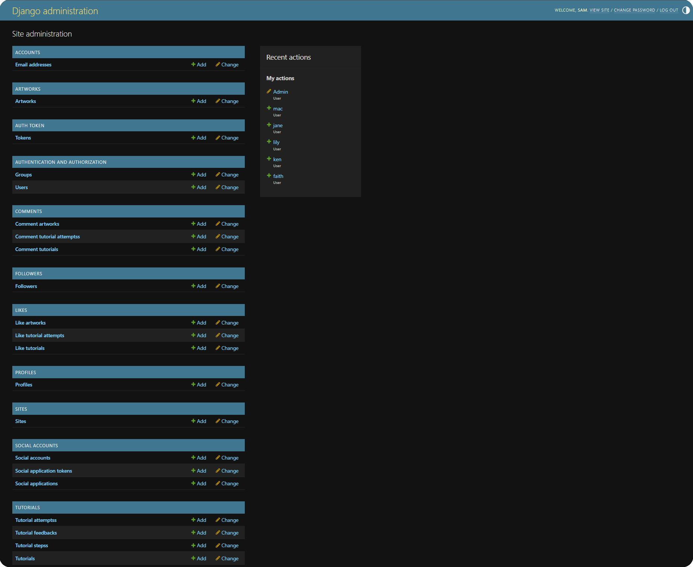

**Below is an overview of key features (each accompanied by a screenshot from the frontend):**

[Back to top ⬆️](#-table-of-contents)

---

#### 🧑‍🎨 User Profile

Every user has a public profile that includes their display name, bio, and profile image. The API supports:

- Viewing any user’s profile via /profiles/ and /profiles/<id>/

- Updating your own profile if is_owner = true

- Automatically including helpful fields in the serializer such as:

  - **profile_image** — Profile picture for easy rendering

  - **is_owner** — To allow conditional editing

  - **following_id** — For toggling follow/unfollow buttons

  - **artworks_count, tutorials_count, tutorials_attempt_count** — Content metrics

  - **followers_count, following_count** — Social engagement stats

These enrich the frontend UI without extra API calls, keeping the interface responsive and context-aware.

🖼️ Screenshot: Profile Detail View
Demonstrates **is_owner**, content counts, social metrics, and editable fields for the authenticated user.
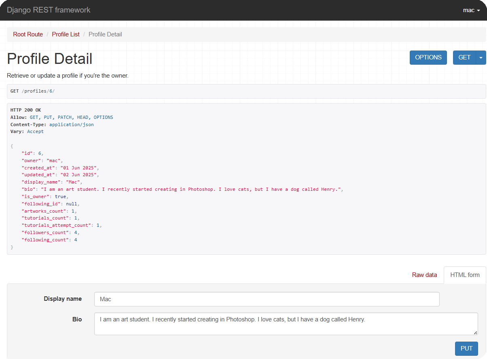

[Back to top ⬆️](#-table-of-contents)

---

#### 🎨 Artwork List View

Returns a paginated list of all artworks posted by users.

This endpoint supports full CRUD operations for authenticated users. It includes custom serializer fields such as:

- **is_owner** – Allows the frontend to check if the current user can edit/delete

- **profile_id and profile_image** – To reduce extra lookup calls

- **artwork_liked_id** – Lets users see if they’ve liked a post and unlike it if needed

- **artwork_comments_count and artwork_likes_count** – Useful for displaying interaction counts on cards

This view supports ordering, search, and filtering by owner.

**Included Fields:**

```id, owner, is_owner, profile_id, profile_image
created_at, updated_at, title, description, image
artwork_liked_id, artwork_comments_count, artwork_likes_count
```

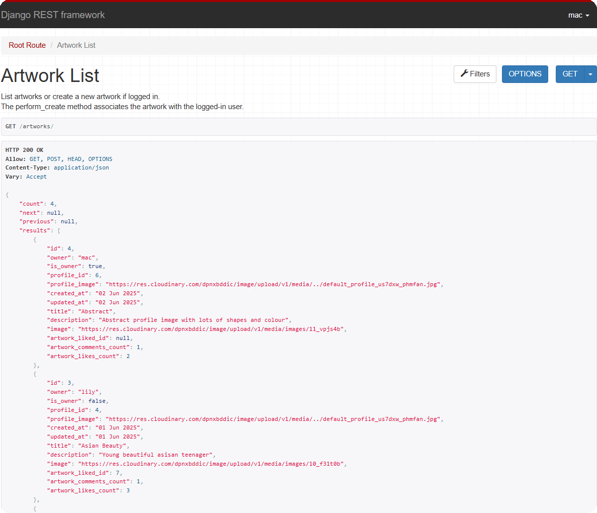

[Back to top ⬆️](#-table-of-contents)

---

#### 💬 Artwork Comments List View

Displays all comments associated with a single artwork. This endpoint supports community interaction through user feedback.

**Serializer additions include:**

- **is_owner** – Indicates whether the comment was written by the current user

- **profile_id, profile_image** – Gives visual identity and relational context

- **artwork** – Clearly ties each comment back to the artwork it's attached to

**Included Fields:**

```
id, owner, is_owner, profile_id, profile_image
artwork, comment_text,created_at, updated_at
```

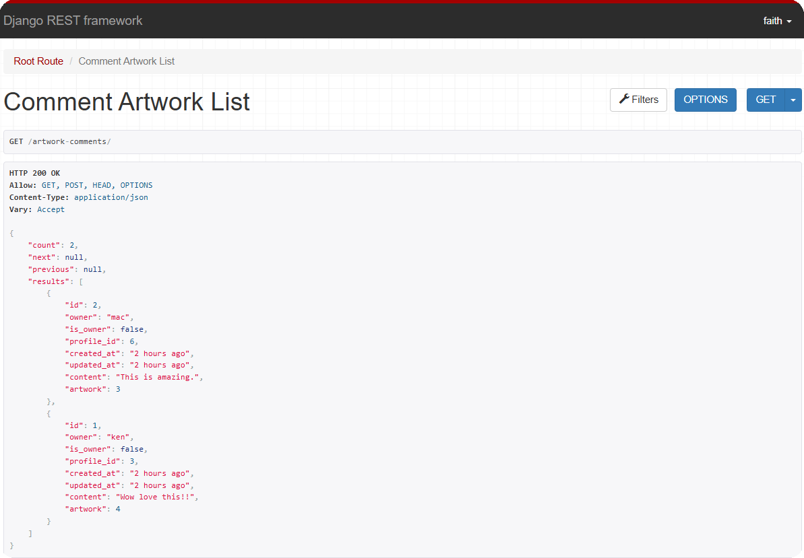

[Back to top ⬆️](#-table-of-contents)

---

#### 📘 Tutorials List View

This view presents all published tutorials, allowing users to explore creative guides shared by mentors. Each tutorial is enriched with metadata and tied to the mentor's profile.

**Serializer enhancements include:**

- **is_owner** - for update/delete visibility

- **profile_id and profile_image** - for quick display of the author's details

- **tutorial_steps_count, tutorial_comments_count, and tutorial_likes_count** - to reflect engagement

- **tutorial_favourited_id** - to track if the current user has favourited the tutorial

**Included Fields:**

```
  id, owner, title, cover_image, created_at, updated_at,
  is_owner, profile_id, profile_image, tutorial_steps_count,
  tutorial_comments_count, tutorial_likes_count, tutorial_favourited_id
```

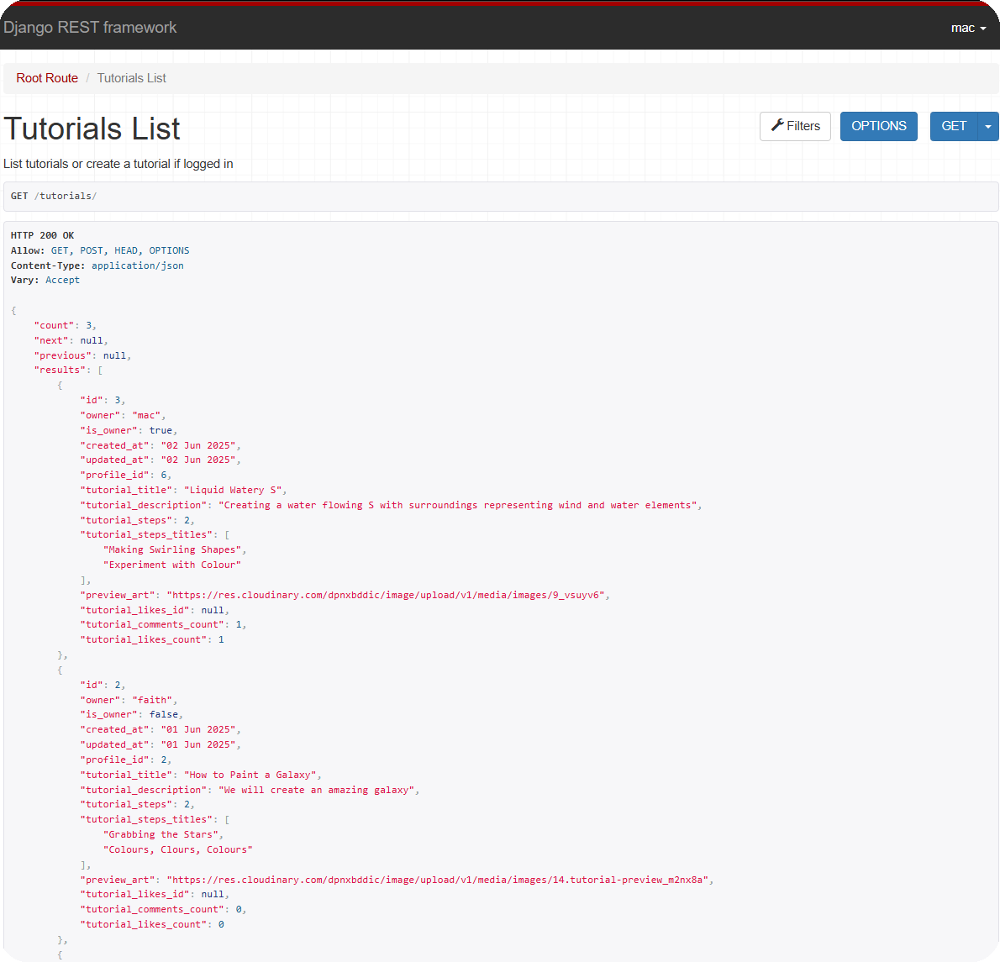

[Back to top ⬆️](#-table-of-contents)

---

#### 🧾 Tutorial Step Detail View

Each tutorial contains multiple steps, viewable via the tutorial step detail endpoint. These provide the full educational breakdown of a tutorial.

**Serializer enhancements include:**

- **is_owner** - for secure edit/delete access

- **profile_id and profile_image** - for attribution

- **tutorial_id** - to link back to the parent tutorial

**Included Fields:**

```
 id, owner, tutorial, title, content, image, created_at, updated_at,
  is_owner, profile_id, profile_image, tutorial_id
```

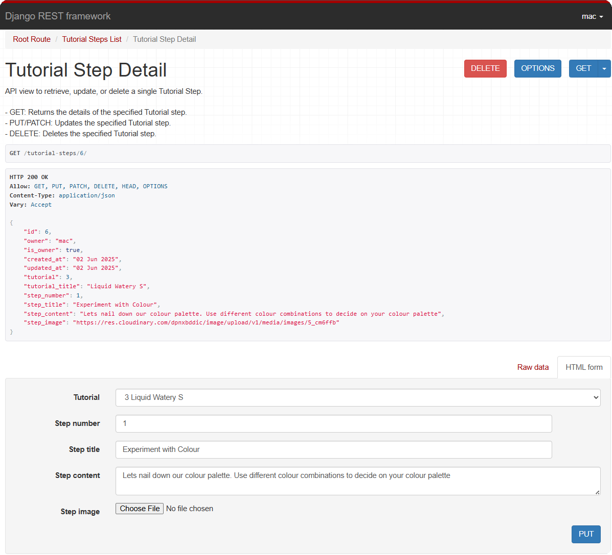

[Back to top ⬆️](#-table-of-contents)

---

#### 🧪 Tutorial Attempt List View

Shows a list of tutorial attempts submitted by users who completed a mentor-led tutorial.

Each attempt includes metadata and useful serializer enhancements to track user engagement and ownership:

- **is_owner** – Helps frontend determine if the edit/delete options should be visible

- **profile_id, profile_image** – Provide instant profile context

- **tutorial_attempt_liked_id** – Whether the current user has liked this attempt

- **tutorial_attempt_comments_count, tutorial_attempt_likes_count** – Interaction metrics

**Included Fields:**

```
id, owner, is_owner, profile_id, profile_image tutorial, created_at,
updated_at, attempt_text, attempt_image tutorial_attempt_liked_id,
 tutorial_attempt_comments_count, tutorial_attempt_likes_count
```

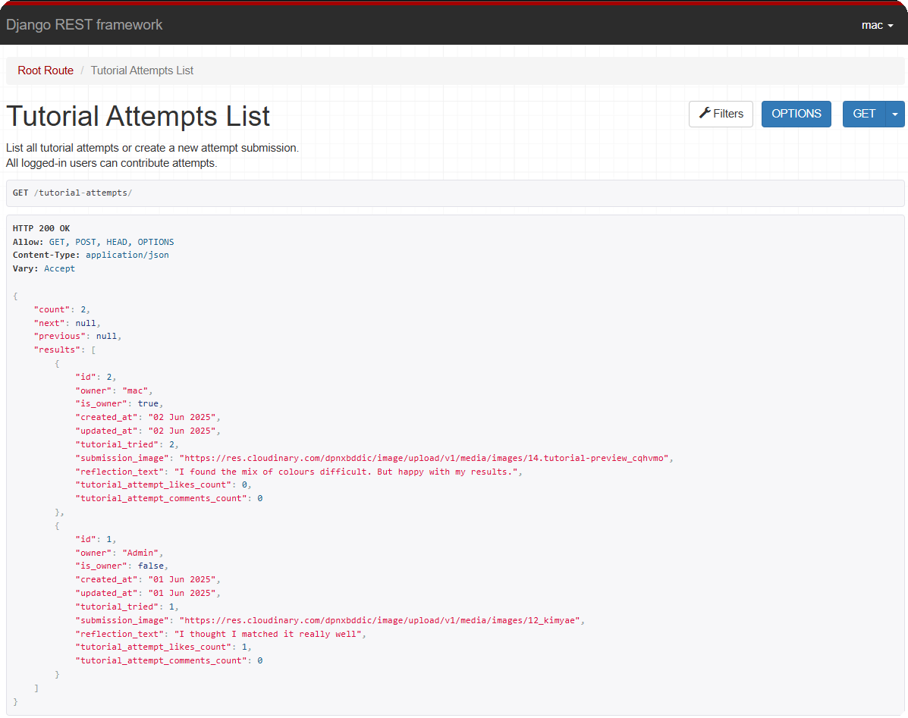

[Back to top ⬆️](#-table-of-contents)

---

#### 💬 Tutorial Feedback View

Mentors can leave feedback on users’ tutorial attempts to help them reflect and improve. This feature supports one-to-one relationships, where each tutorial attempt can have exactly one feedback item.

**Serializer enhancements include:**

- **is_owner** - for edit/delete visibility

- **profile_id and profile_image** - to show which mentor provided the feedback

- **tutorial_attempt_id** - to link the response clearly to the original submission

**Included Fields:**

```
id, owner, tutorial_attempt, content, created_at, updated_at,
is_owner, profile_id, profile_image, tutorial_attempt_id
```

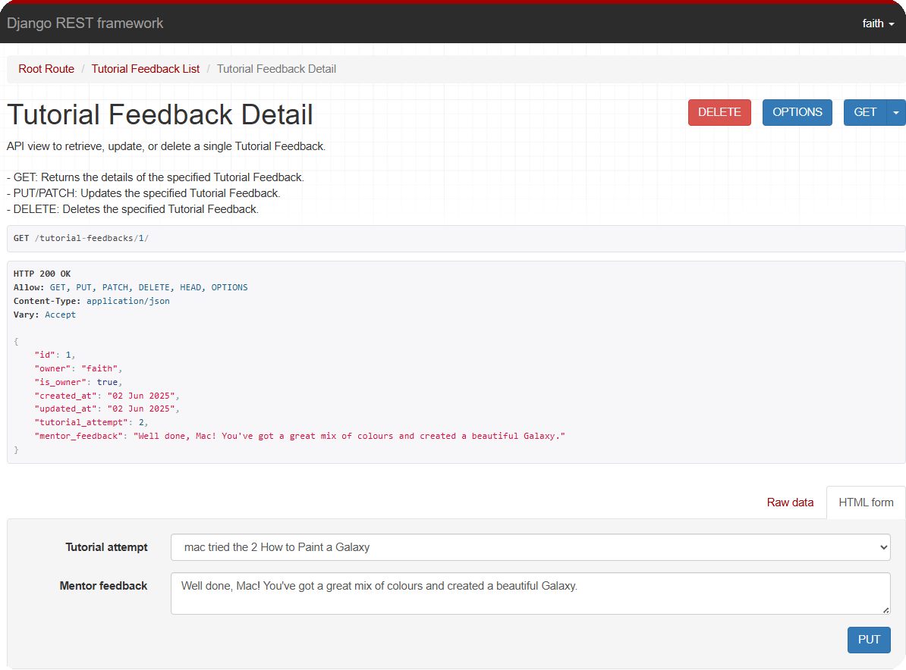

[Back to top ⬆️](#-table-of-contents)

---

#### 👥 Followers List View

Displays all follow relationships associated with the current user — either as the follower or the followed. This endpoint is key to powering personalized content like tailored artwork and tutorial feeds.

**Serializer enhancements include:**

- **followed_name and followed_profile_image** - to easily identify who the user is following

- **created_at** - to indicate when the follow relationship began

- **owner** - for traceability and admin control

**Included Fields:**

```
id, owner, followed, followed_name, followed_profile_image, created_at
```

✨ This view also demonstrates pagination in action, returning results in batches to improve performance and frontend rendering. The presence of next, previous, and count fields in the response makes it ideal for dynamic list components.

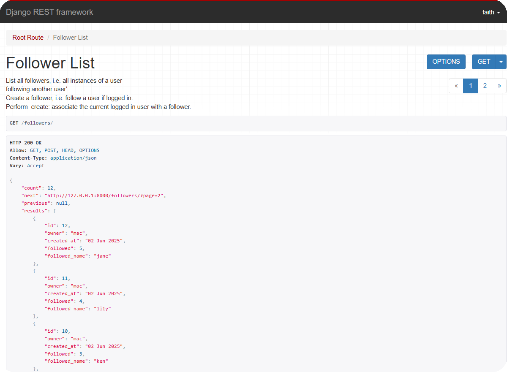

[Back to top ⬆️](#-table-of-contents)

---

## 🔍 API Filtering, Searching, and Ordering

The ArtifexLab API supports **filtering**, **searching**, and **ordering** on selected endpoints using Django REST Framework’s built-in query parameters.

These features make it possible to:

- View artwork by users you follow
- Display content based on popularity
- Support search functionality for discoverability

[Back to top ⬆️](#-table-of-contents)

---

### 🎨 Artwork List Filters

The `/artworks/` endpoint includes the following filters:

| Filter                            | Description                                                                    |
| --------------------------------- | ------------------------------------------------------------------------------ |
| `owner__followed__owner__profile` | Returns artworks created by users the current user is following (used in feed) |
| `likes__owner__profile`           | Returns artworks liked by a specific user profile                              |
| `owner__profile`                  | Returns artworks created by a specific user profile                            |

**Example usage:**

```
/artworks/?owner__followed__owner__profile=2
/artworks/?likes__owner__profile=5
```

[Back to top ⬆️](#-table-of-contents)

---

### 🔎 Search and Ordering

The `search` parameter allows users to search by title or description (where applicable), and results can be sorted using `ordering` query parameters.

Common ordering fields include:

- `created_at`
- `artwork_likes_count`
- `artwork_comments_count`

**Example usage:**

```
/artworks/?search=landscape&ordering=-artwork_likes_count
```

---

📘 **Tutorial endpoints** also support similar filters, search, and ordering options — including filtering by followed users, favourited tutorials, and sorting by engagement metrics like likes or comments.

[Back to top ⬆️](#-table-of-contents)

---

## 🚀 Deployment

Deployment for this Django REST API was handled via **Heroku**, with **PostgreSQL** as the production database and **Cloudinary** hosting user-uploaded media.<br>The **Pillow** library is used to support image processing, making it compatible with **Cloudinary** uploads.<br> You can find the full step-by-step deployment process in the dedicated file here 👉 [DEPLOYMENT.md](/DEPLOYMENT.md)

---

## 🔐 Authentication & Permissions

The **ArtifexLab API** uses token-based authentication powered by **dj-rest-auth** and **JWT**, ensuring that users can securely log in, log out, and access protected routes.

#### 🪪 Authentication

Authentication tokens are required for any actions that involve creating, editing, or deleting content. Unauthenticated users can view public data but cannot interact with the platform.

#### 🛡️ Permissions

Permissions are enforced using Django REST Framework’s built-in classes:

`IsAuthenticatedOrReadOnly` - allows full access to logged-in users, while visitors can only view content.

`IsOwnerOrReadOnly` - ensures that only the creator of an object (e.g., a post, comment, or tutorial) can update or delete it.

Attempts to access or modify unauthorized content will return a 401 (Unauthorized) or 403 (Forbidden) response, keeping user data safe and secure.

[Back to top ⬆️](#-table-of-contents)

---

## 📚 Helpful Resources

Throughout development, I made a strong effort to keep my code **DRY** _(Don’t Repeat Yourself)_ and maintainable.<br> To support this, I explored ways to create reusable base classes for **models**, **serializers**, and **views**.

**These resources were especially helpful in guiding me through that process:**

- [Creating a Base Serializer (Stack Overflow)](https://stackoverflow.com/questions/33137165/django-rest-framework-abstract-class-serializer?newreg=adb169505ce64135a559eed23d578f26) - Helped me understand how to reduce repetition across similar serializers
- [Creating Custom Generic Views (DRF Docs)](https://www.django-rest-framework.org/api-guide/generic-views/#creating-custom-base-classes) - Useful for building DRY views with shared logic
- [How to Create Abstract Model Class in Django? (GeeksForGeeks)](https://www.geeksforgeeks.org/how-to-create-abstract-model-class-in-django/)
  [Django Documentation - Abstract base classes](https://docs.djangoproject.com/en/5.2/topics/db/models/#model-inheritance) - Official guide that solidified my understanding of how to extend models cleanly

These approaches helped me avoid unnecessary duplication while keeping the codebase flexible and easy to maintain.

[Back to top ⬆️](#-table-of-contents)

---

## 🔮 Future Enhancements

While the current version of the ArtifexLab API delivers all the core functionality needed to power the platform, there are several features that could be valuable additions in future development phases:

#### ✨ Planned Ideas for Expansion

- **Dropdown Filters on Feed Page**
  Allow users to toggle between different views like My Feed, Favourites, or Most Popular for a more tailored experience.

- **Video Uploads for Tutorials**
  Support video content to enhance the educational aspect of tutorials beyond images and text.

- **Downloadable Tutorial PDFs**
  Give users the option to download PDF versions of tutorials for offline use or long-form study.

#### 🚫 Won’t Haves (for MVP)

**To stay focused and on schedule, the following features were excluded from the initial scope:**

- **Reset Forgotten Password** – Excluded due to implementation complexity and time constraints

- **Messaging or Real-Time Chat** – Planned as a potential social enhancement for future versions

- **Notifications for Activity** – Such as likes, comments, or new followers — not essential for MVP but valuable later

> 💡 These Won’t Haves are still included in the GitHub Backlog column to demonstrate full MoSCoW planning and keep the roadmap transparent.

[Back to top ⬆️](#-table-of-contents)

---

## 🧪 Testing

Manual testing all the way — there was a lot to cover!
All 🧪 tests and 🐞 bugs are documented in one handy place 👉 [TEST.md](/TEST.md)

[Back to top ⬆️](#-table-of-contents)

---

## 🏅 Honourable Mentions

This project wouldn’t have been possible without a little help (and a lot of encouragement) from some incredible people:

- **Rory Patrick Sheridan** – My first mentor, who saw me through my first four projects and helped me build the confidence to keep going.
- **Richard Wells** – My second mentor for this final project. Generous with his time, full of insight, and the steady voice I needed to carry out this mammoth build.
- **My family** – For all the love and support 💖 and to my amazing kids for understanding why their mum wasn’t always as available as before 💖.
- **Code Institute** – For the DRF-API walkthrough project, which gave me a solid launchpad while I planned out my own vision.
- **Stack Overflow** – For being the unofficial co-pilot of coders everywhere.
- **Django & DRF Docs** – For being genuinely helpful (and impressively readable!).
- **GitHub Copilot** – For that uncanny autocomplete when I needed a nudge.
- **ChatGPT** – Ever-present coding assistant, breaking down code lines so I could understand them better, planning partner (and great soundboard!), bug detective, and cheerleader 🥳

[Back to top ⬆️](#-table-of-contents)
